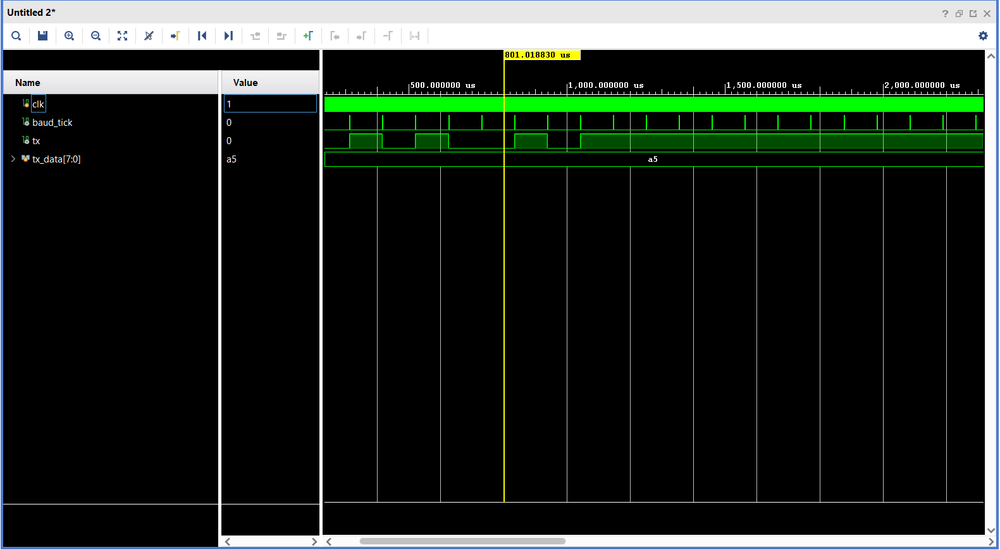
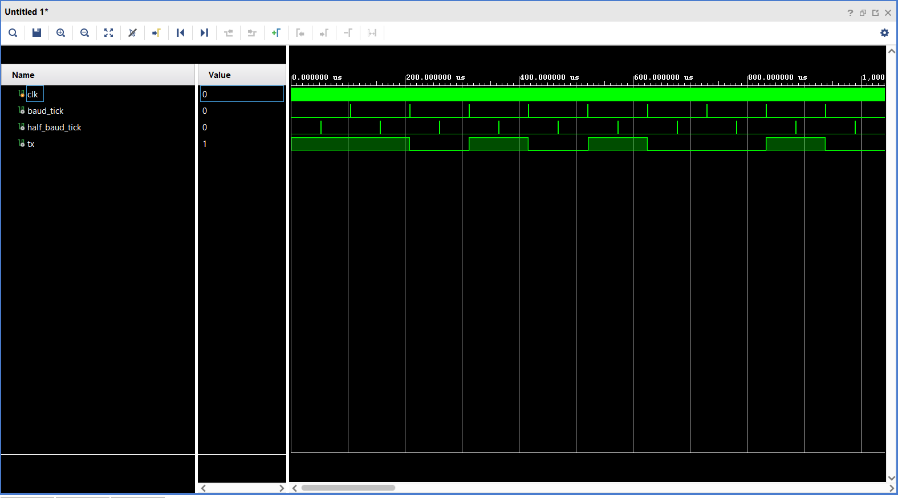
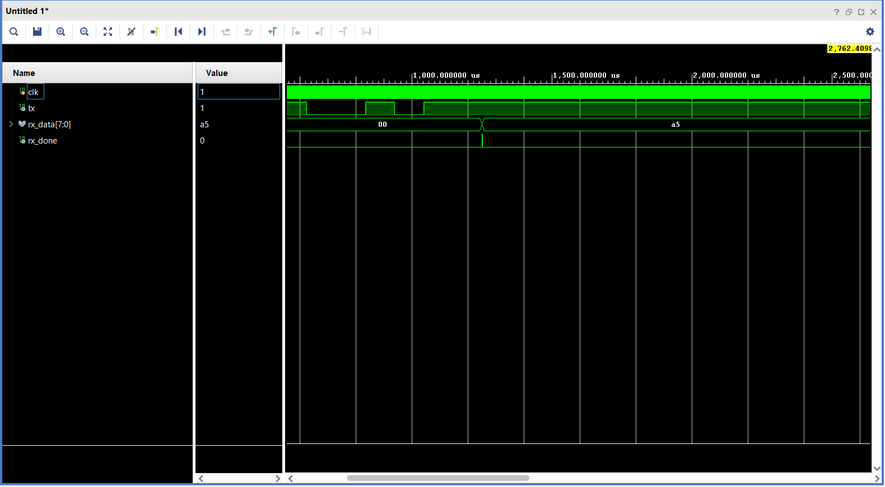
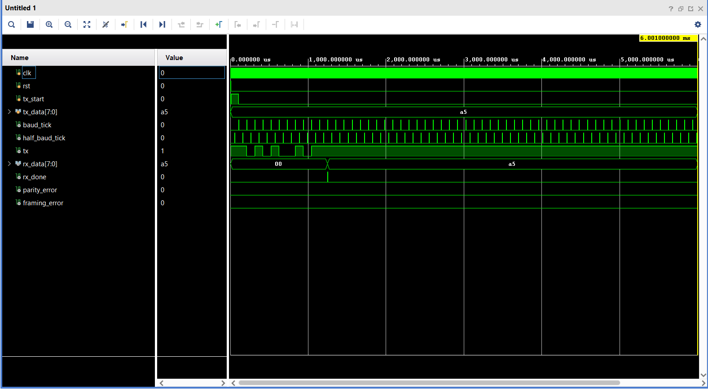
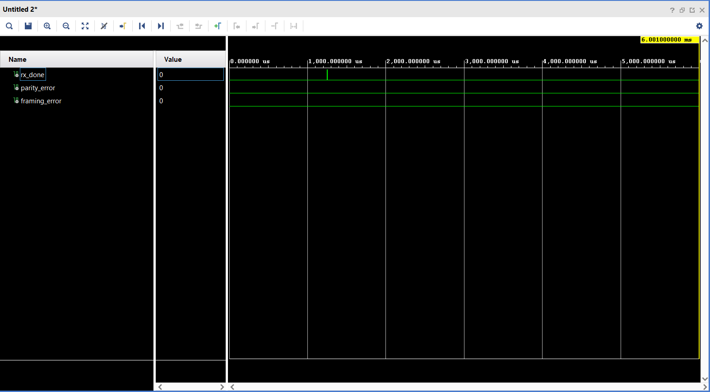
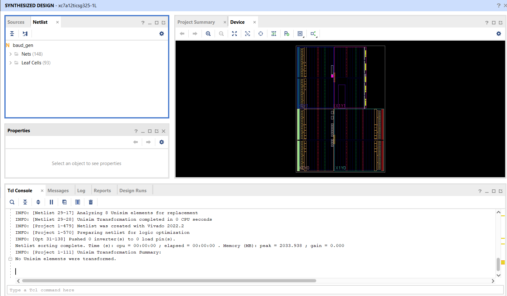
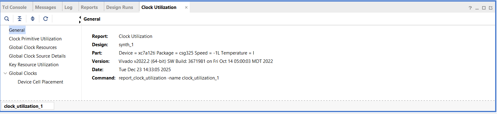

# UART Transmitter & Receiver (Verilog HDL)

FPGA-ready implementation of a **UART (Universal Asynchronous Receiver Transmitter)** using **Verilog HDL**, featuring baud-rate generation, FSM-based TX/RX, and error detection.  
Designed, simulated, and synthesized using **Xilinx Vivado 2022.2**.

---

## Project Overview

This project implements a complete UART communication system suitable for FPGA deployment.  
It demonstrates reliable asynchronous serial communication using finite state machines, precise baud-rate timing, and robust receive-side validation.

A loopback testbench is used to verify correct end-to-end data transmission from TX to RX.

---

## UART Configuration

| Parameter      | Value                         |
|----------------|-------------------------------|
| Data bits      | 8                             |
| Parity         | Even                          |
| Stop bits      | 1                             |
| Frame format   | 8E1                           |
| Baud rate      | Parameterized (default: 9600) |
| System clock   | 100 MHz                       |

---

## Design Architecture

The UART system consists of the following RTL modules:

### Baud Rate Generator (`baud_gen.v`)
- Generates `baud_tick` and `half_baud_tick`
- Parameterized for clock frequency and baud rate
- Provides a shared timing reference for TX and RX

### UART Transmitter (`uart_tx.v`)
- FSM-based serial transmitter
- Appends start bit, data bits (LSB first), even parity bit, and stop bit
- Outputs `tx`, `tx_busy`, and `tx_done`

**FSM Flow:**  
`IDLE → START → DATA → PARITY → STOP → IDLE`




### UART Receiver (`uart_rx.v`)
- Uses mid-bit sampling for reliable data recovery
- FSM-based receiver design
- Detects framing errors by validating stop bit
- Outputs `rx_data`, `rx_done`, and `framing_error`

**FSM Flow:**  
`IDLE → START → ALIGN → DATA → STOP → IDLE`






### Top Module (`uart_top.v`)
- Integrates baud generator, transmitter, and receiver
- Designed for FPGA synthesis and testing

---

## Simulation and Verification

- Loopback testbench connects TX output directly to RX input
- Verified correct bit-level serialization and reconstruction across baud boundaries
- Confirmed correct baud-aligned mid-bit sampling
- Simulated using **Vivado Simulator**




---

## Error Detection

- **Even parity** generation and checking
- **Framing error detection** by validating stop bit integrity
- Error flags are asserted synchronously with `rx_done` to simplify system-level integration.




---

## FPGA Synthesis Results




- **Target Device:** xc7a12ticsg325-1L (Artix-7)
- **Tool:** Xilinx Vivado 2022.2
- Successfully synthesized with low resource utilization

### Resource Utilization (Post-Synthesis)

| Resource        | Used |
|-----------------|------|
| Slice LUTs      | 28   |
| Slice Registers | 34   |
| BUFG            | 1    |
| DSP             | 0    |
| BRAM            | 0    |

Detailed reports and screenshots are included in the repository.



---

## Project Structure

```text
UART_P&F/
├── rtl/
│   ├── baud_gen.v
│   ├── uart_tx.v
│   ├── uart_rx.v
│   └── uart_top.v
├── tb/
│   └── uart_loopback_tb.v
├── docs/
│   ├── baud_gen_utilization_synth.pdf
│   ├── synthesized_netlist.png
│   └── clock_utilization.png
├── tx_frame_structure.png
├── rx_mid_bit_sampling.png
├── rx_done_and_data.png
└── README.md
```

---

## Tools Used

- Verilog HDL
- Finite State Machines (FSM)
- UART Protocol
- Xilinx Vivado 2022.2
- FPGA synthesis and timing analysis

---

## Author

**Aswin S**  
Electronics and Communication Engineering  
FPGA & RTL Design | Embedded & Digital Systems

